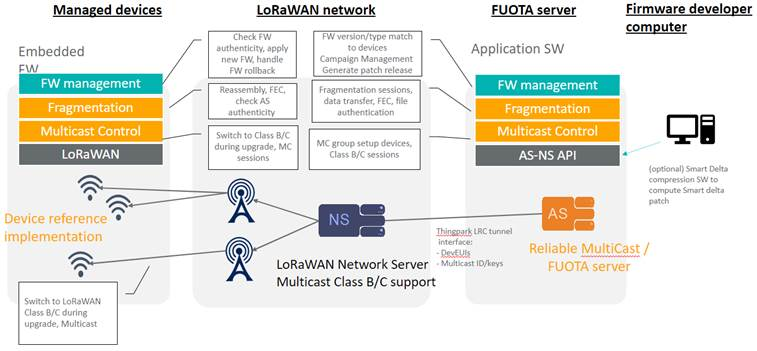

# ThingPark FUOTA functionalities

## High-level feature description

Actility ThingPark FUOTA is a standalone server that interacts with the
ThingPark LRC LoRaWAN® network server to control end devices, set of end
devices, Multicast Groups, Regions and Campaigns.

It supports the following device management functions:

-   Large file transfer to groups of devices
-   Secure firmware update over the air to groups of devices
-   Unitary or group device configuration management
-   Management of multicast groups on the LRC network server and update
    of devices' FUOTA configuration to add or remove them from the
    groups
-   Management of multicast class B or class C sessions and update of
    devices' OTA configuration to start and stop the sessions
-   Management of data fragmentation sessions and update of devices' OTA
    configuration to receive large files as fragmented data
-   Fragmentation protocol without Error Correction ("carousel") to
    support low RAM devices
-   Application-level device time synchronization
-   Organization of update campaigns to optimize battery and radio
    consumption
-   Generation of compressed delta firmware patches
-   Monitoring of upgrade campaigns, including current campaign stage,
    number of devices successfully upgraded and number of aborts or
    failures at each stage
-   Scheduling of firmware update campaigns to minimize impact on
    network and business operation
-   Export of accounting records
-   Mass export/import of various objects (devices, device lists,
    multicast groups, etc.)

The ThingPark FUOTA architecture also offers and optional optimized
differential firmware update compression ("Smart Delta") feature. This
feature is supported by compression software that may be used directly
on the device firmware repository or on the developer computer, as well
as a device side library.

The FUOTA functionality requires a server, a number of managed devices
implementing a FUOTA client application, and a LoRaWAN network
supporting class A, as well as class B and/or class C communication.
When differential firmware update compression is used, the compression
algorithm which generates the "Smart Delta" patch can run on a separate
computer. The high-level architecture is illustrated in the figure below.

The ThingPark FUOTA server performs upgrade campaign and session
management for devices, setting up necessary sessions on the device side
and providing in-band and out-of-band information to the ThingPark
Wireless Network Server for Multicast setup.

## Compressed delta update feature ("Smart Delta")

The LoRa Alliance FUOTA protocol only specifies the transmission of
large files over a multicast session. Simple FUOTA clients usually only
support transmission of full firmware upgrades, which are often large
and therefore require unrealistic downlink traffic. One of the key
advantages of the ThingPark FUOTA Server is support of compressed
differential firmware upgrades ("Smart Delta"), as well as an optimized
device-side client library (currently available only for ST
Microelectronics MCU based devices).

During a differential upgrade session, only the modified parts of the
binary are transmitted. The compression mechanism does not require any
special preparation and planning of firmware image, unlike partial
updates which can change only contiguous regions of device firmware. The
provided device side library takes care of updating pointers as required
in the unmodified parts of the binary.

Typical compression ratio for two consecutive firmware versions is
around 8 (e.g. new firmware with 100 KB size will be compressed to a 12
KB Smart Delta patch).

The Smart Delta upgrade feature requires prior knowledge of the firmware
version currently loaded to the device. If this information is not
available, the FUOTA Server will request the currently running firmware
version from the device.

Smart Delta patch generation requires unencrypted firmware images. The
provided compression Linux executable (Contact Actility to get the
binary file adapted to your OS) can be run offline by the device
firmware development team to generate an optimized Smart Delta patch.
Smart Delta patch itself is signed to guarantee necessary firmware
upgrade security.

Smart Delta feature is compatible with ST Microelectronics SBSFU package
and supplied as a plug-in library.