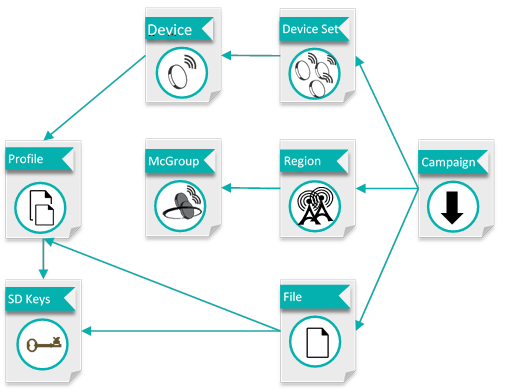

# Server objects

The ThingPark FUOTA server manages multiple objects that are necessary
for managing devices. For more information on the FUOTA server
configuration, see [Managing FUOTA objects](/Managing-FUOTA-objects/#managing-objects-in-thingpark-fuota).

## Device

This object manages the information that is necessary for communicating
with End Devices using Unicast protocol.

It is extending the Device object of ThingPark Wireless and contains the
following information.

| Parameter                   | Description                                                  |
| --------------------------- | ------------------------------------------------------------ |
| **DevEUI**                  | Device unique identifier                                     |
| **Tag**                     | Freeform text to search for one or multiple devices          |
| **Name**                    | Freeform text for device identification                      |
| **Multicast Class Capable** | B,C / Multicast session class supported by the device        |
| **LoRaWAN Version**         | 1.0, 1.1 / Class of the unicast identity of the device       |
| **Device Key**              | GenAppKey for LW1.0 device / AppKey for LW1.1 device         |
| **Device Profile**          | Device lifecycle configuration                               |
| **Firmware**                | Current firmware version of the device                       |
| **Firmware changed**        | Timestamp when device firmware version number was last updated in the FUOTA server. Used to decide when we need to refresh firmware version knowledge. |
| **Archived**                | Archived objects are not shown in the UI but present in the system to build usage reports. |

## Device Set

This object allows to group devices together, so they can be selected
easily together to participate to a campaign. It contains the following
information.

| Parameter       | Description                                                  |
| --------------- | ------------------------------------------------------------ |
| **Name**        | Freeform text for device set identification                  |
| **Description** | Freeform paragraph for device set identification             |
| **Devices**     | List of devices DevEUIs which are included into a device set |
| **Archived**    | Archived objects are not shown in the UI but present in the system to build usage reports |

## Reliable Multicast group

This object manages the information that is necessary for communicating
with End Devices using the LoRa Alliance Reliable Multicast protocol for
Class B or C. It is extending the LoRaWAN Multicast Group object of
ThingPark Wireless and contains the following information.

| Parameter                 | Description                                                  |
| ------------------------- | ------------------------------------------------------------ |
| **DevEUI**                | Device unique identifier of the Multicast group / This value is not used on the radio but must be recorded for ThingPark Wireless provisioning |
| **Tag**                   | Freeform text to search for one or multiple Multicast Groups |
| **Name**                  | Freeform text for Multicast Group identification             |
| **ISM Band**              | EU868, US915, AS923 / Unlicensed band in which the devices operate, it will determine the maximum fragment size the FUOTA server can use |
| **DL Dwell Time**         | Only valid in AS923 ISM band, refer to LoRaWAN® Regional Parameters to understand its impact on maximum fragment size |
| **DevAddr**               | § Multicast group address used on the radio interface / This value must have been reserved in ThingPark Wireless before being assigned manually to the group, so it is assigned uniquely in the ThingPark Wireless system |
| **Multicast Frequency**   | Ping Slot RF frequency in Hz for Multicast Class B and RX2 frequency in Hz for Multicast Class C |
| **Multicast DataRate**    | Downlink data rate used on Ping Slot for Multicast Class B and RX2 frequency for Multicast Class C. For more information, see the *LoRaWAN® Regional Parameter User Guide* for complete description of this field |
| **Redundancy**            | Ratio of uncoded fragments over total number of fragments (coded + uncoded) in percent / Example: 50% means that for every uncoded fragment, a coded fragment is added |
| **Ping Slot Periodicity** | Periodicity of the Ping slot in seconds for Multicast (class B only) |
| **McKey**                 | 128-bit reliable multicast master key used during Reliable Multicast session / If it is not provided a random one is generated |
| **Session Class**         | B or C / LoRaWAN® class of the temporary multicast session   |

## Region

This object allows to group Reliable Multicast Groups together, so they
can be selected easily together to form a geographic area on which the
campaign runs. It contains the following information.

| Parameter            | Description                                                  |
| -------------------- | ------------------------------------------------------------ |
| **Name**             | Freeform text for region identification                      |
| **Description**      | Freeform paragraph for region identification                 |
| **Multicast Groups** | List of Multicast Groups DevEUI identifiers                  |
| **Archived**         | Archived objects are not shown in the UI but present in the system to build usage reports |

## File

This object stores a binary or firmware file to download via a
fragmentation session, along with metadata describing the file itself.

| Parameter                 | Description                                                  |
| ------------------------- | ------------------------------------------------------------ |
| **Name**                  | Freeform text for binary file identification                 |
| **Description**           | Freeform paragraph for binary file identification            |
| **Upload time**           | Timestamp when file was uploaded to FUOTA server             |
| **File size**             | Size of original file before any encoding                    |
| **File type**             | Binary file or firmware upgrade file                         |
| **Firmware Base Version** | Device base version expected for this binary processing (delta patch only) |
| **Firmware Version**      | Firmware target version. Use Actility format X.Y.Z.P so FUOTA server supports notification for downgrade and upgrades, or a freeform 32-bit format but FUOTA server can only notify about firmware differences |
| **Device Profile**        | Device lifecycle configuration                               |
| **Time Tolerance**        | Time tolerance configuration uploaded with this firmware     |
| **Default UL period**     | Uplink rate configuration uploaded with this firmware        |
| **FUOTA Library**         | Type of device library used to process multicast related commands, fragmentation session and firmware upgrade |
| **Smart Delta Key**       | § Key used to sign delta firmware patches. The public part of this key must be used by devices to verify FUOTA server signature (for smart delta updates) and the fact that the patch was created by FUOTA server / This field is not displayed for delta firmware files |
| **Archived**              | Archived objects are not shown in the UI but present in the system to build usage reports |

## Device profile

Device profile contains important information (Producer ID, Module ID,
HW Revision and HW Version) needed to match device instances and
firmware file which can be used for upgrade.

It also contains some firmware properties which are required for proper
operation of Campaign configured for given device instances (Time
Tolerance, Default UL period, FUOTA Library).

Finally, it contains parameter needed for statistics collection and
optionally billing purposes (MCU Type). Producer ID, Module ID, HW
Revision and HW Version parameters of given device type could be
imported from Device Profile configured in ThingPark Wireless.
Relationship of FUOTA Device Profile with other FUOTA server objects is
described in 2.5.

| Parameter             | Description                                                  |
| --------------------- | ------------------------------------------------------------ |
| **Name**              | Freeform text for device profile identification              |
| **Description**       | Any additional information relevant to help device profile administration |
| **Producer ID**       | Producer ID                                                  |
| **Module ID**         | Module ID                                                    |
| **HW Revision**       | HW Revision                                                  |
| **HW Version**        | HW Version                                                   |
| **Time Tolerance**    | Time tolerance configuration uploaded with this firmware     |
| **Default UL period** | Uplink rate configuration uploaded with this firmware        |
| **MCU Type**          | MCU Type                                                     |
| **FUOTA Library**     | FUOTA Library                                                |
| **Smart Delta Key**   | Key used to sign delta firmware patches. The public part of this key must be used by devices to verify FUOTA server signature (for smart delta updates) and the fact that the patch was created by FUOTA server |
| **Archived**          | Archived objects are not shown in the UI but present in the system to build usage reports |

## Campaign

This object manages the information necessary for running Multicast
Setup, Binary Transfer or Firmware Update campaigns.

For more information about types of campaign, see the figure at the end of the topic.

Campaigns are configured with the following information.

| Parameter                                       | Description                                                  |
| ----------------------------------------------- | ------------------------------------------------------------ |
| **Name**                                        | Freeform text for campaign identification                    |
| **Description**                                 | Freeform paragraph for campaign identification               |
| **Created**                                     | When campaign was initially created                          |
| **Started**                                     | When campaign was started                                    |
| **Last Changed**                                | When campaign was last updated                               |
| **Campaign type**                               | “Configure Multicast Groups” just for multicast group and session configuration in device, then exit (for instance, send commands to a group of devices via multicast) / “Upload Binary File” campaigns that simply deliver arbitrary binary file to devices (for instance, message to advertisement screen) / “Firmware Upgrade Over the Air” which is firmware delivery campaign type |
| **Device Sets**                                 | List of IDs of all Device Sets included into campaign        |
| **Regions**                                     | List of IDs of all Regions in the campaign                   |
| **Device reboot date**                          | Manually configured Device reboot date                       |
| **Device reboot time**                          | Manually configured Device reboot time                       |
| **Frag session start**                          | Manually configured multicast session start date             |
| **Frag session start time**                     | Manually configured multicast session start time             |
| **File (except for Multicast setup campaigns)** | File uploaded to device                                      |
| **Status**                                      | Current campaign state; could be CONFIGURED, RUNNING, STOPPED, FAILED, SUCCEEDED |
| **Duration**                                    | Campaign duration in minutes                                 |
| **Maximum duration**                            | Defines a duration in minutes after which, devices will fall back to their original class (Class A typically). It preserves device battery in case of campaign failure due to bad radio environment |
| **Success threshold**                           | Percentage of devices above which the campaign is considered successful / The server will stop retransmission at the end of the campaign phase in case the campaign is successful / New campaigns can be started with reduced set of all failed devices that will consume less radio resources |
| **Archived**                                    | Archived objects are not shown in the UI but present in the system to build usage reports |

## Smart Delta key

Smart Delta keys are used to verify that a Smart Delta patch received by
a device has been created by a legitimate FUOTA Server. This
verification is done thanks to an ECDSA signature created using Smart
Delta key and appended to the patch binary by FUOTA server. At the end
of a FUOTA campaign, devices verify the signature using the Smart Delta
public key which is embedded into Smart Delta library.

A Smart Delta key pair (private and public keys) should be obtained by
the device manufacturer for given version of the Smart Delta library.
Different firmware versions could contain different (or same) version of
Smart Delta library.

| Parameter       | Description                                                  |
| --------------- | ------------------------------------------------------------ |
| **Name**        | Freeform text for Smart Delta Key identification             |
| **Description** | Freeform paragraph for Smart Delta Key identification        |
| **Private Key** | Private Key for Smart Delta library                          |
| **Archived**    | Archived objects are not shown in the UI but present in the system to build usage reports |

## Server object's relationships

The following figure illustrates the relationship between
all objects controlled by ThingPark FUOTA.

