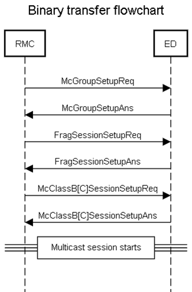
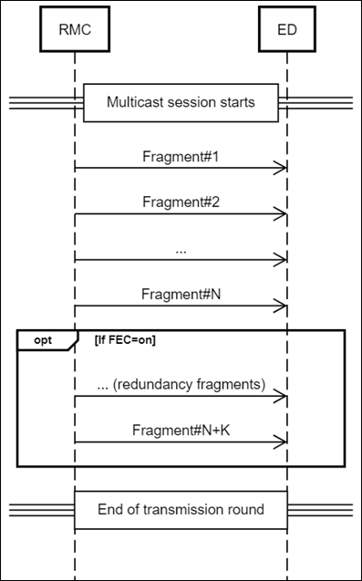
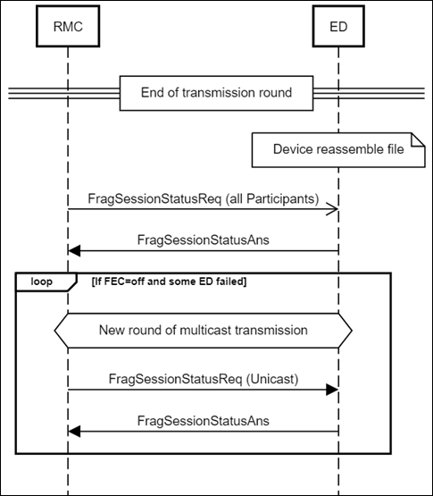

# Binary transfer campaign

In this mode of operation, the RMC Agent sends the following sequence of
messages using the generic message exchange procedure.

#### Stage 1 - McGroupSetup

The RMC Agent sends **McGroupSetupReq** to each device of the campaign
and expects **McGroupSetupAns** response.

If the device already belongs to this McGroup, it is considered as a
successfully setup.

The actual message exchange between the RMC Agent and the LRC is
described in [Generic Message Flow During Campaign Setup](/FUOTA-functionalities/FUOTA-update-campaigns/#generic-message-flow-during-campaign-setup).

#### Stage 2 - FragSessionSetup

The RMC Agent sends a FragSessionSetupReq to each device of the campaign
and expects a FragSessionSetupAns response.

The actual message exchange between the RMC Agent and the LRC is
described in [Stage 4 - McClassB\[C\]SessionSetup](/FUOTA-functionalities/FUOTA-update-campaigns/firmware-update-campaign/#stage-4-mcclassb-c-sessionsetup).

#### Stage 3 - McClassB\[C\]SessionSetup

The RMC Agent sends a **McClassB\[C\]SessionSetupReq** to each device of
the campaign and expects a **McClassB\[C\]SessionSetupReq**.

For **McClassCSessionSetupReq** the RMC Agent configures a session start
time to start at completion of FragSessionSetup stage 2.

For **McClassBSessionSetupReq** RMC Agent configures a session start
time to start at completion of FragSessionSetup stage 2. Beacon
acquisition should be completed at session start time specified and RMC
Agent will start sending fragments exactly at this moment*.*

Session start time is automatically computed *McClassB\[C\]SessionSetup*
stage time if it was not manually configured.

Multicast session duration time which is configured in the device by
**McClassB\[C\]SessionSetupReq** is calculated as T = *Initial campaign
start* + *Maximum duration -- session start time*.
For more information, see [RMC Agent Configuration](/FUOTA-server-configuration-logging/RMC-agent-configuration/).

The actual message exchange between the RMC Agent and the LRC is
described in [Generic Message Flow During Campaign Setup](/FUOTA-functionalities/FUOTA-update-campaigns/#generic-message-flow-during-campaign-setup).

#### Stage 4 - DIFragment

RMC Agent sends **DlFragment** over multicast, starting with uncoded
fragments.

If FEC=on, redundancy fragments are also sent.

The actual message exchange between the RMC Agent and the LRC is
described in [Generic Message Flow During Campaign Setup](/FUOTA-functionalities/FUOTA-update-campaigns/#generic-message-flow-during-campaign-setup).

#### Stage 5 - FragSessionStatus

Once all fragments have been sent, the RMC Agent sends a
**FragSessionStatusReq** over multicast with Participant=1, if the
number of devices in multicast group is greater than
*fsession_status_threshold* or over unicast, if it is equal or lower
than this threshold. Also Participant=1 will be used if FEC is disabled.

The RMC Agent expects a **FragSessionStatusAns** within
`*fsession_status_spread*` seconds from each device.
`*fsession_status_spread*` value is provisioned in the device during
*FragSessionSetupReq* and calculated as fsession_status_spread = N / 16+1, where N is equal to the number of devices in the campaign. If the result is greater than 128 seconds, it will be set to 128.

*fsession_status_threshold, fsession_status_spread* are parameters
specified in the RMC Agent configuration file `config.ini`.

For more information, see [RMC Agent Configuration](/FUOTA-server-configuration-logging/RMC-agent-configuration/).

The actual message exchange between the RMC Agent and the LRC is
described in [Generic Message Flow During Campaign Setup](/FUOTA-functionalities/FUOTA-update-campaigns/#generic-message-flow-during-campaign-setup).

#### Stage 6 - Multiple Rounds of Transmissions

If FEC=on, the transmission completes after the last redundancy
fragment. If not enough devices have succeeded in Stage 5, the campaign
is declared FAILED.

If FEC=off, and less than *Success_threshold* devices have succeeded, a
new round of multicast transmission is scheduled. Number of data
fragments transmission rounds is limited by *datafrag_loops_max*.

At the end of each retransmission round, the RMC Agent sends
**FragSessionStatusReq** over multicast with Participant=0.

RMC Agent expects a **FragSessionStatusAns** within
*fsession_status_spread* seconds from each device.

If less than *Success_threshold* devices have succeeded and *Maximum
timeout* is expired or *datafrag_loops_max is reached*, the campaign is
declared FAILED.

Actual message exchange between RMC Agent and LRC is described in
[Generic Message Flow During Campaign Setup](/FUOTA-functionalities/FUOTA-update-campaigns/#generic-message-flow-during-campaign-setup).

*Success_threshold*, *fsession_status_spread and datafrag_loops_max*
areparameters specified in the RMC Agent configuration file `config.ini`.

For more information, see [RMC Agent Configuration](/FUOTA-server-configuration-logging/RMC-agent-configuration/).