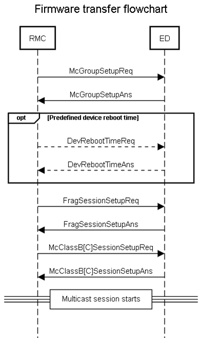
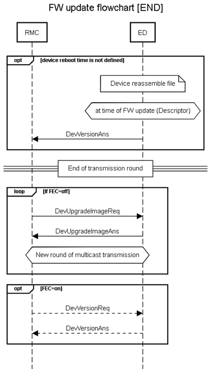
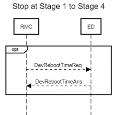
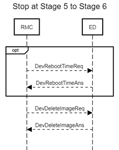

# Firmware update campaign

In this mode of operation, FUOTA server follows the same start sequence
as for binary campaign, with the exception that a preliminary stage is
executed first using generic message exchange procedure.

#### Stage 1 - McGroupSetup

Same as for the binary campaign.

#### Stage 2 -- DevRebootTime

If device reboot time is manually configured for the campaign the RMC
Agent sends a **DevRebootTimeReq** to each device of the campaign to
setup device reboot time before which specifies when firmware will be
applied.

#### Stage 3 - FragSessionSetup

Same as for the binary campaign.

#### Stage 4 - McClassB\[C\]SessionSetup

Same as for the binary campaign.

#### Stage 5 - DlFragment

Same as for the binary campaign.

#### Stage 6 -- UpgradeImage

If FEC=off, RMC Agent sends **DevUpgradeImageReq** to all devices.
**DevUpgradeImageAns** indicates if new firmware image is ready to be
applied for the device. If there is no ready image on the device is
considered still participating in the campaign. If less than
*Success_threshold* devices have succeeded, a new round of multicast
transmission is scheduled for FEC=off campaign.

The actual message exchange between the RMC Agent and the LRC is
described in [Generic Message Flow During Campaign Setup](/FUOTA-functionalities/FUOTA-update-campaigns/#generic-message-flow-during-campaign-setup).

#### Stage 7 -- Completion Verification

The RMC Agent expects to receive a **DevVersionAns** from all devices
which completed the file transfer successfully. If device reboot time
was not scheduled manually and no answer is received from some devices
after the end of the Multicast transmission (including redundancy
fragments for FEC=on case), the RMC Agent sends **DevVersionReq**
message over unicast and expects **DevVersionAns**. The device is marked
as pass or fail depending whether it answered with correct version.

If device reboot time was scheduled manually RMC Agent will wait until
device reboot time comes before starting standard upgrade complete
verification processing.

The actual message exchange between the RMC Agent and the LRC is
described in [Generic Message Flow During Campaign Setup](/FUOTA-functionalities/FUOTA-update-campaigns/#generic-message-flow-during-campaign-setup).

## Firmware update campaign stop processing

When Campaign is interrupted by user some cleanup processing should be
performed to prevent devices from unwanted upgrade and to stop
unnecessary traffic. Campaign could be interrupted in different stages
and different cleanup actions will be performed.

**Campaign** **was interrupted at STAGE 1 to STAGE** **4**

Stop any further Campaign processing and do not move to any new stage
after the current stage. If during STAGE 2 **DevRebootTimeReq** was sent
to the device with delayed reboot time then special **DevRebootTimeReq**
with RebootTime = 0xFFFFFFFF will be sent to the device to cancel
reboot, see the figure in Stage 4.

**Campaign was interrupted at STAGE 5** **or at STAGE 6**

Stop any further Campaign processing and do not move to any new stage
after the current stage. Stop sending data fragments. If during STAGE 2
**DevRebootTimeReq** was sent to the device with delayed reboot time
then special **DevRebootTimeReq** with **RebootTime** = 0xFFFFFFFF will
be sent to the device to cancel reboot.

Delete any assembled firmware image from
the device to prevent its installation after next reboot. Image is
deleted by sending **DevDeleteImageReq** command, see the figure at the top of this topic.

