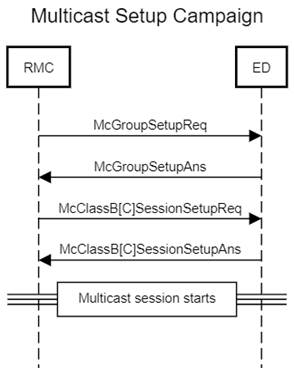

# Multicast setup campaign

In this mode of operation, the RMC Agent follows the following message
flow.

#### Stage 1 - McGroupSetup

The RMC Agent sends **McGroupSetupReq** to each device of the campaign
and expects **McGroupSetupAns** response.

If the device already belongs to this McGroup, it is considered as a
successfully setup.

The actual message exchange between the RMC Agent and the LRC is
described in *Generic Message Flow During Campaign Setup.*

#### Stage 2 - McClassB\[C\]SessionSetup

The RMC Agent sends a **McClassB\[C\]SessionSetupReq** to each device of
the campaign and expects a **McClassB\[C\]SessionSetupReq**.

For **McClassCSessionSetupReq** the RMC Agent configures a session start
time to start at completion of stage 1.

For **McClassBSessionSetupReq** RMC Agent configures a session start
time to start at completion of stage 1. Beacon acquisition should be
completed at session start time specified and user application could
start sending data to device via multicast group exactly at this
moment*.*

Multicast session duration time which is configured in the device by
**McClassB\[C\]SessionSetupReq** is calculated as T = *Initial campaign
start* + *Maximum duration -- session start time*.
For more information, see *RMC Agent Configuration*.

The actual message exchange between the RMC Agent and the LRC is
described in *Generic Message Flow During Campaign Setup*.