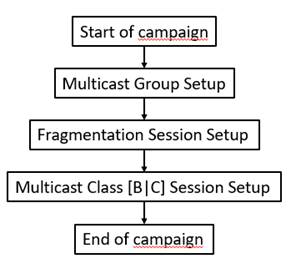
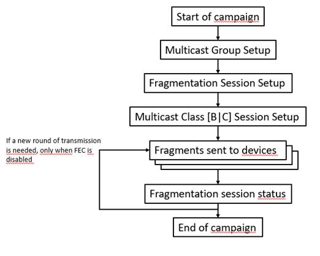
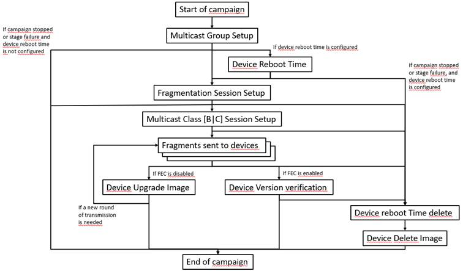
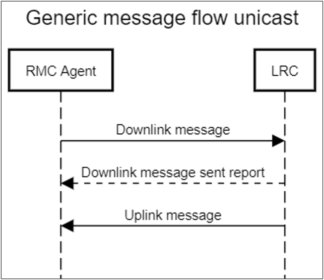
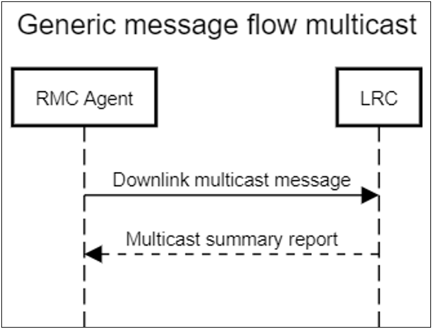

# Update campaigns

FUOTA server operations are organized by update campaigns. Campaigns are
operating over a set of Device Sets and Regions.

Three types of operations are supported.

| Operation                         | Description                                                  |
| --------------------------------- | ------------------------------------------------------------ |
| **Configure Multicast Groups**    | Multicast groups are created dynamically, a temporary Multicast session is open and commands are sent over the air to devices. No file transfer is involved for this type of campaign |
| **Upload Binary File**            | A generic binary file is transferred to devices over the air over a Multicast Group and within a temporary Multicast session and Fragmentation session. Device behavior once the file is received is vendor-specific |
| **Firmware Upgrade Over the Air** | A firmware file is transferred to devices over the air over a Multicast Group and within a temporary Multicast session and Fragmentation session. The campaign completes once devices have reported their updated firmware version |

### Campaign overviews

Each type of FUOTA campaign is a state machine managed by the ThingPark
FUOTA server. This topic presents a high-level view of state machines,
and topics [Generic Message Flow During Campaign Setup](/FUOTA-functionalities/FUOTA-update-campaigns/#generic-message-flow-during-campaign-setup) through [Firmware update campaigns](/FUOTA-functionalities/FUOTA-update-campaigns/firmware-update-campaign/) present the details of each stage and
transition.

#### Configure Multicast Group campaign overview

#### Upload binary file campaign overview

#### Firmware upgrade over the air overview

### Generic message flow during campaign setup

In order to initiate a campaign, FUOTA server initially communicates
with the device by sending unicast downlinks and processing uplinks from
ThingPark LRC network server via LRC-AS tunnel interface. The actual
software module that carries on this procedure is the RMC Agent. For
more information about RMC Agent, see [RMC Agent](/FUOTA-server-architecture/RMC-agent/).

The generic message flow between the RMC Agent and the LRC via the
LRC-AS tunnel interface for unicast frames is shown on the figure in the first step 3. The
generic message flow for multicast frames is shown in the figure later in the second step 3. Actual
protocol command/response data payload which is sent between the RMC
Agent and the End Device is encapsulated in these messages.

**Note** that all campaigns described in the following sections are
using this generic message flow.

During campaign setup phase, the ThingPark FUOTA server exchanges
unicast messages with each device participating to the campaign:

1. RMC Agent sends a Downlink message with protocol request payload to the LRC. The RMC Agent will send Downlink messages with a minimum interval of "*ucast_msg_delay"*  milliseconds.

2. The RMC Agent expects the Downlink message sent report from the LRC. If the Downlink message sent report was not received or no response for Downlink message from a device was received within "*ucast_msg_delay"* seconds, the RMC Agent resends the Downlink message.

3. After the Downlink message sent report is received by the RMC Agent, it expects an Uplink message with a protocol response payload within response timeout in
   seconds based on the lowest uplink rate for devices participating in a stage. If the Uplink message was not received for any device, the RMC Agent resends Downlink message.

   

The request/response message exchange described above over all devices
is called the "SETUP stage".

The SETUP stage continues until either "*Success threshold"* devices,
participating in the campaign, have succeeded to complete the setup
flow (the RMC Agent receives a valid response from them) or sending
retries count has been reached (configured by *"msg_retries"*
property) or campaign's "*Maximum duration"* seconds time has passed.
"*Success threshold"* and "*Maximum duration"* are parameters
configured for the campaign.

The next stage - the FILE TRANSFER stage-, will not start until "late
answer" time has passed. This time is calculated based on the lowest
uplink rate for devices participating in a stage. This time is
required to collect late uplinks from some devices.

*"ucast_msg_delay", "delivery_timeout", "msg_retries"* are parameters
specified in the RMC Agent configuration file `config.ini`.

For more information, see [RMC Agent Configuration](/FUOTA-server-configuration-logging/RMC-agent-configuration/).

During file transfer of binary and firmware upgrade campaigns, multicast
messages are sent by RMC Agent using following generic message flow:

1. The RMC Agent sends a Downlink message to the LRC to multicast group address (multicast virtual device). The RMC Agent will never send any multicast Downlink message earlier than "*mcast_msg_delay*" milliseconds from the previous multicast Downlink message sent.

2. If the "*summary_reports_disabled*" parameter is not set, the RMC Agent expects a Multicast summary report message from an LRC. If a Multicast summary report message was not received within expected time ("*summary_report_timeout*" -- delay_factor based on number
   of devices in multicast group), the RMC Agent will stop to wait summary report and send next Downlink message. If "*summary_report_timeout*" is equal to 0, the RMC Agent will wait
   indefinitely for the Multicast summary report and Downlink message sending will be paused.

3. This process is repeated for every data fragment and lasts until all uncoded and coded fragments are sent when FEC is activated, or until all uncoded fragments are sent when FEC is deactivated.

   This process is also used when the protocol command request is sent via multicast, but for just one frame. For more information, see [Stage 5 - FragSessionStatus](/FUOTA-functionalities/FUOTA-update-campaigns/binary-transfer-campaign/#stage-5-fragsessionstatus).

*"mcast_msg_delay", "summary_reports_disabled", "summary_report_timeout"*  are parameters specified in the RMC Agent configuration file `config.ini`. For more information, see [RMC Agent Configuration](/FUOTA-server-configuration-logging/RMC-agent-configuration/).
