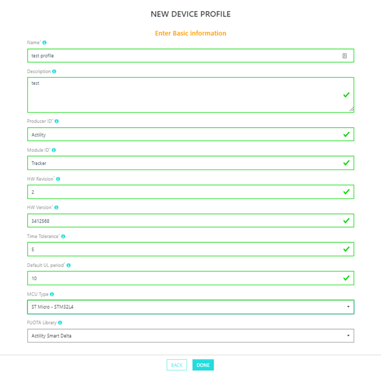
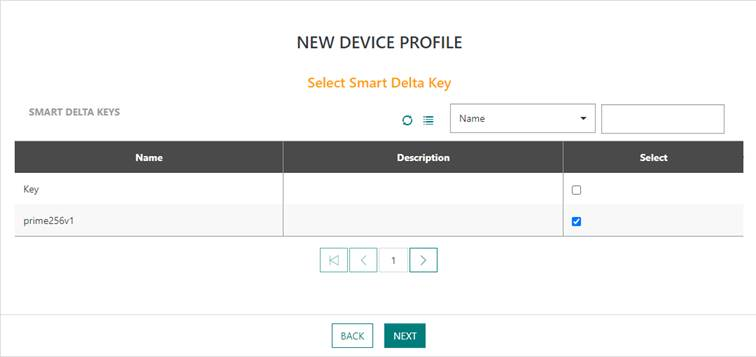
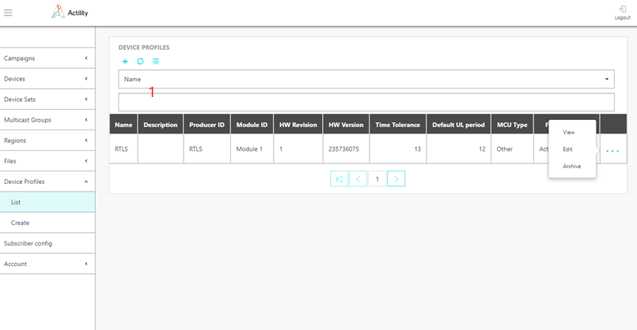
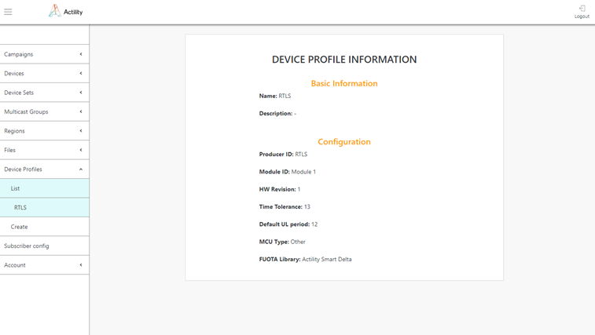

# Managing device profiles

Device profile are associated to devices to bind the device to a given
firmware file, and also to provide parameters which are specific to
devices running this firmware (e.g. default uplink rate, device clock
drift, etc).

The tuple {Producer ID, Module ID, HW Revision} should be unique among
all device profiles.

##  Provisioning a new device profile

1.  Select *Device Profiles \> Create,* and enter the following
    information:

    -   **Name**: freeform text for device profile identification
    -   **Description**: any additional information relevant to help device
    profile administration
    -   **Producer ID**: text that identifies manufacturer of the device
    -   **Module ID**: text that identifies device model among all devices
    produced by given manufacturer
    -   **HW Revision**: 1-byte number which identifies hardware variant for
    given device model
    -   **HW Version**: 4-byte version of hardware as reported by the device in
    ***DevVersionAns*** reply. Its value is vendor-specific
    -   **Time Tolerance (in seconds)**: possible device clock drift which
    should be tolerated by FUOTA when starting multicast session. Time
    tolerance specified in Device profile configuration will be
    overridden by Time tolerance specified in File configuration.
    -   **Default UL period (in seconds)**: UL period affects a lot of timers
    which control unicast commands stages of the campaign. FUOTA use
    provided value to automatically calculate these timers. Default UL
    period specified in Device profile configuration will be overridden
    by Default UL period specified in File configuration.
    -   **MCU type**: MCU type which is used by device
    -   **FUOTA Library**: "Smart Delta" or "Other 3rd Party". The type of
    device library used to process reliable multicast related commands,
    fragmentation session and firmware upgrade

2.  On the next screen, select the Smart Delta key which will be used to
    sign Smart Delta files created by the FUOTA Server. Smart Delta key
    configuration can be omitted if given device profile does not
    contain Smart Delta library, or if Smart Delta feature should not be
    used.

## Provisioning a device profile using the API

Creation can also be performed by API using /deviceprofiles endpoint.

1.  Prepare your FUOTA credentials. The user authentication is based on
    "basic auth" method.

2.  Contact Actility to get the domain name of the URL: `https://<domainname>/FOTACore-API/`

## Browsing device profiles

The list of device profiles currently provisioned in the system can be
obtained via *Device Profiles \> List* ().

- The table contains information about all device profiles in the
  system and their parameters. Device profiles list could be filtered
  by information in any column using selector 1 at the top of the
  screen.

  

- By pressing the "+" option at the top you will be brought into
  Device profiles Create screen.

- "..." option at the end of the Device Profile information row will
  show up menu 2 which will allow to "View" complete information about
  device profile (), "Edit" device profile information and "Archive"
  device profile. Archived device profile will be no more listed in
  the device profiles information table. Archived device profiles can
  be retrieved via API. Contact Actility for more details.

