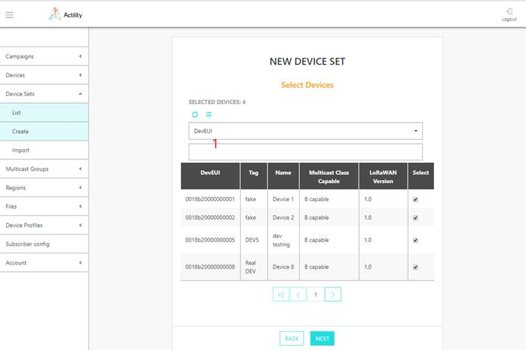
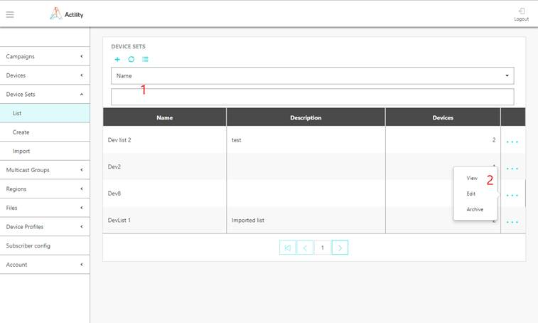
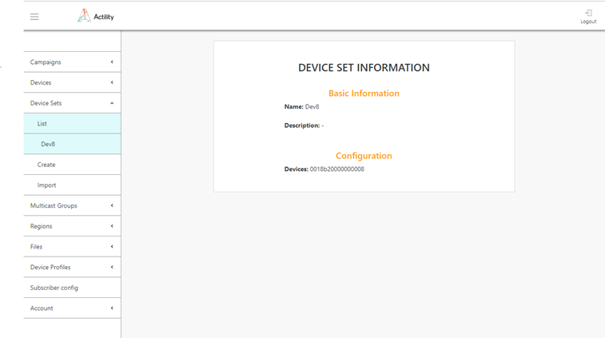

# Managing device sets

## Provisioning a device set

Device sets are not provisioned in ThingPark Wireless. They are only used by ThingPark FUOTA server for management of device groups.

1.  Select *Device Sets \> Create*, and enter the information below in the
    first screen:

    -   **Name**: freeform text for device set identification
    -   **Description**: freeform paragraph for device set identification

2.  Then select devices in the second screen, by clicking on checkboxes on the right of the rows of devices to be added in the set (). The device list can be filtered by information in any column using selector 1 at the top of the screen.



3.  Then, click DONE in the third screen.

### Provisioning device sets using mass import

1. Click *Device sets* *> Import.*

2. Click *Sample file.*

3. Create your import file based on the sample file. The file format is as follows:

   - CSV (rfc4180) with no header row and comma-separated
   - All fields the field marked “MANDATORY” should contain valid data for given field otherwise import will finish with error
   - Data in the fields marked “OPTIONAL” could be not present
   - Column A: mandatory, name
   - Column B: optional, description
   - Column C: mandatory, list of semicolon-separated DevEUIs

Example:

 ```json
 DevList 1,Imported list,18b20000000001;18b20000000002
 ```

4. Click the paper clip button, and select your import file.

5. Click *Import*.

### Provisioning a device set using the API

Creation of a device set can also be performed by API using /devlists endpoint.

1.  Prepare your FUOTA credentials. The user authentication is based on “basic auth” method.

2.  Contact Actility to get the domain name of the URL: `https://<domainname>/FOTACore-API/`

## Create a device set based on failed devices after FUOTA campaign

When a campaign has been executed and some devices have failed the
campaign, it is possible to create a device list including these failed
devices only. This is useful if you want to repeat a recovery campaign
only for these devices later.

1.  Select *Campaigns* *\>* *List*

2.  Click on the "3 dots" at the end of the campaign row and select
    "Create device set from failed devices" and confirm.

A new device set is automatically created with a name "Automatically
generated". The device set description includes the name and date of the
campaign from which the list has been built.

## Create a device set based on failed devices after FUOTA campaign Using the API

Creation of a device set based on failed devices can also be performed
by API using /generate/devlist_from_campaign/{campaignId} endpoint.

1.  Prepare your FUOTA credentials. The user authentication is based on
    "basic auth" method.

2.  Contact Actility to get the domain name of the URL: `https://<domainname>/FOTACore-API/`

## Browsing device sets

List of device sets currently provisioned in the system c be obtained via
*Device Sets \> List* .



-   Table contains information about all device sets in the system and
    their parameters.

-   Device sets list could be filtered by information in any column
    using selector 1 at the top of the screen.

-   By pressing "+" option at the top you will be brought into Device
    Sets Create screen.

-   "..." option at the end of the device set information row will show
    up menu 2 which will allow to "View" complete information about
    device set, "Edit" device set information and "Archive"
    device set. Archived device set will be no more listed in the device
    sets information table. Archived device sets can be retrieved via
    API. Contact Actility for more details.

