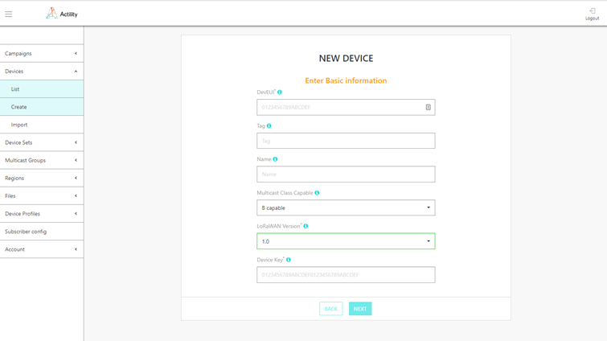
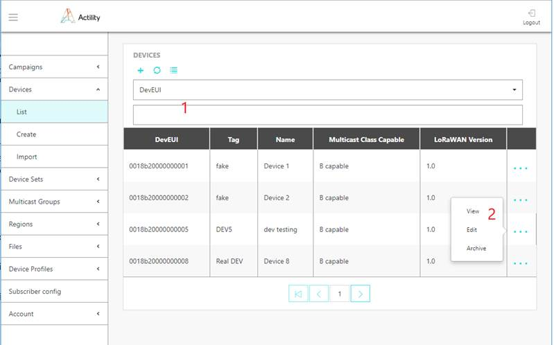
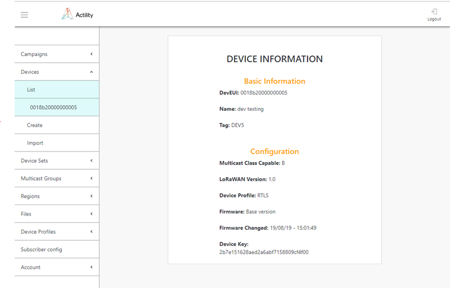

# Managing devices

## Prerequisite: Provisioning devices on the LoRaWAN network with ThingPark Wireless

Before provisioning the device in ThingPark FUOTA server, the device
must be provisioned in the LoRaWAN network using the ThingPark Wireless
platform.

1.  Provision the device in ThingPark Wireless. You can provision
    devices one by one or by mass import. Refer to *ThingPark Wireless
    Device Manager User Guide* for full details.

2.  This initial provisioning is setting up the Unicast identity of the
    device, and must use the following parameters:

    -   **LoRaWAN® Class**: all classes are supported including Class A
    -   **Unicast keys (AppKey / AppEUI for OTAA and AppSKey / NwkSKey for
    ABP)**: must match the ones provisioned in the device and must be
    recorded for provisioning in the FUOTA and RMC server
    -   **Connectivity Plan**: allocate a Unicast connectivity plan according to
    device class
    -   **AS Routing profile**: point to FUOTA AS which is defined in
    Application Server section of the Device Manager, with the following
    parameters
        -   **Type**: HTTP Application Server
        -   **Content-type**: JSON untyped
        -   **Source ports**: \*
        -   **Destinations**: Contact Actility to get the domain name.
        -   **Routing strategy**: Sequential

## Provisioning devices in ThingPark FUOTA

The devices must be already provisioned in ThingPark Wireless as
outlined in the previous section.

### Provisioning a device 

1.  Select *Devices \> Create* and enter below information:

    -   **DevEUI**: device unique identifier
    -   **Tag**: freeform text to search for one or multiple devices
    -   **Name**: freeform text for device identification
    -   **Multicast Class Capable**: which multicast session type is supported
    by the device
    -   **LoRaWAN Version**: LoRaWAN protocol version
    -   **Device Reliable Multicast key**: value provisioned on device side to
    secure reliable multicast sessions. Note that this key is only used
    at the Reliable Multicast application layer and is not known by
    ThingPark Wireless. This is the Multicast **GenAppKey** for LoRaWAN
    1.0 devices or **AppKey** for LoRaWAN 1.1 devices



### Provisioning devices using mass import

You can import devices using *Devices \> Import*.

The device import algorithm proceeds as follows:

-   Checks if the device profile with matching producer ID, module ID
    and HW revision exists in the system. If no matching profiles are
    found, the device import fails with error.

-   If the firmware revision field is empty, no file link will be
    attached to the device.

-   If the firmware revision field is not empty, the import procedure
    searches for all files with a name matching one of the devices and a
    version matching the firmware version of the device.

-   If several files are found, for example if several smart delta
    patches from different base versions to the same target version are
    available, the first available will be linked to the device. If
    another file is needed to be linked, it must be done manually after
    import.

1.  Click *Devices \> Import*.

2.  Click *Sample file*.

3.  Create your import file based on the sample file. The file format is
    similar to the one exported by ThingPark Wireless but with the
    following changes:

    -   CSV (rfc4180) with no header row and comma-separated
    -   Content of the fields marked as "n/a" is ignored
    -   All fields the field marked "MANDATORY" should contain valid data
    for given field otherwise import will finish with error
    -   Data in the fields marked "OPTIONAL" could be not present
    -   Data in columns A, C to J, L to V, Z is ignored
    -   Column B: mandatory, DevEUI
    -   Column K: optional, device name
    -   Column W: mandatory, device supported LoRaWAN protocol version
    -   Column X: optional, AppKey for LoRaWAN 1.1 devices
    -   Column Y: optional, GenAppKey for LoRaWAN 1.0 devices
    -   Column AA: optional, multicast session supported by device
    -   Column AB: optional, device tag
    -   Column AC: optional, device firmware version
    -   Column AD: required, producer ID of the device
    -   Column AE: required, module ID of the device
    -   Column AF: required, HW revision of the device

:::warning IMPORTANT

Parameters in column AD to AF must be present. They
together determine the device profile to apply. It is supposed that
these parameters are available during export from ThingPark Wireless
system. The device profile with matching producer ID, module ID and HW
revision must exist prior to import, otherwise the import for the
device will fail.

:::

Examples:

``` json
,0123456789ABCDEF,,,,,,,,,Device

1,,,,,,,,,,,,LORAWAN_1\_0,,0123456789ABCDEF0123456789ABCDEF,,B,TEST,1.0.0.0,Producer
1,Module 2,3\
\"\",DEADBEEFDEADBEEF,,,,,,,,,Device 2,,,,,,,,,,,,LORAWAN_1\_1,
0123456789ABCDEF0123456789ABCDEF,,,C,TEST1,1.0.0.1,Producer 2,Module 3,1
```

4.  Click the paper clip button, and select your import file.

5.  Click *Import*.

### Provisioning a device using the API

Creation of a device can also be performed by API using /devices
endpoint.

1.  Prepare your FUOTA credentials. The user authentication is based on
    "basic auth" method.

2.  Contact Actility to get the domain name of the URL: `https://<domainname>/FOTACore-API/`

## Browsing devices

The list of devices currently provisioned in the system can be obtained
via *Devices \> List.*

- The table contains information about all devices in the system and
  their parameters.

- The device list can be filtered by information in any column using
  selector 1 at the top of the screen.

  

- By clicking the "+" button at the top of the frame, you will be
  brought into Device Create screen.

- "..." option at the end of the device information string will show
  up menu 2 which will allow to "View" complete information about
  device, "Edit" device information and "Archive" device. Archived
  device will be no more listed in the device information table.
  Archived devices can be retrieved via API. Contact Actility for more
  details.

