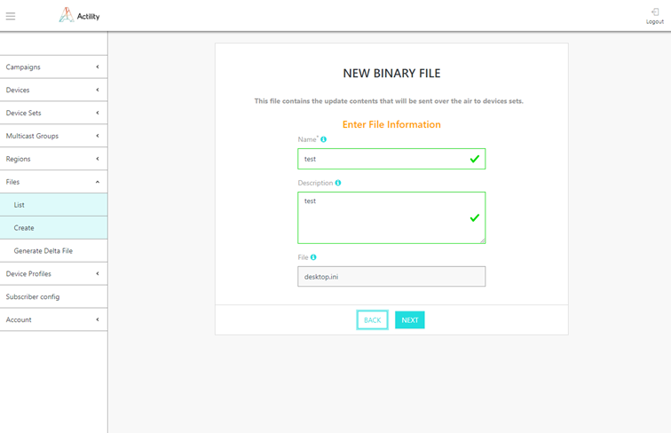
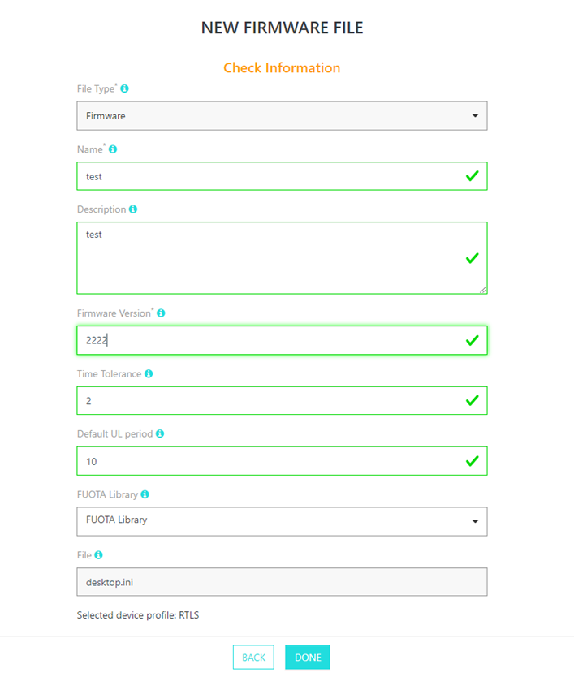
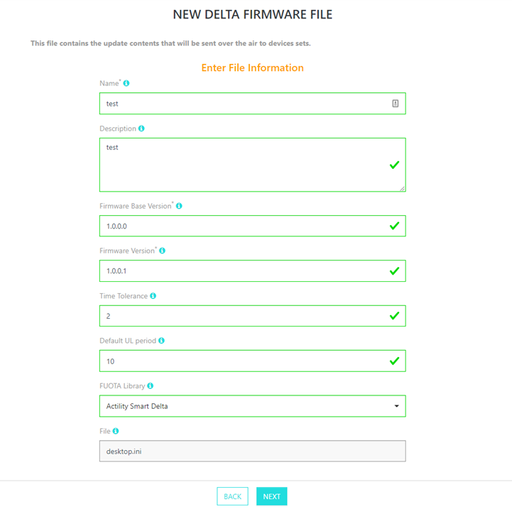
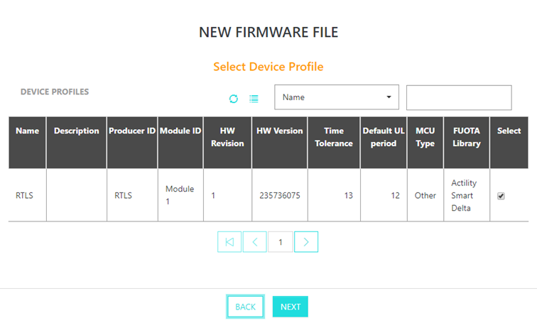
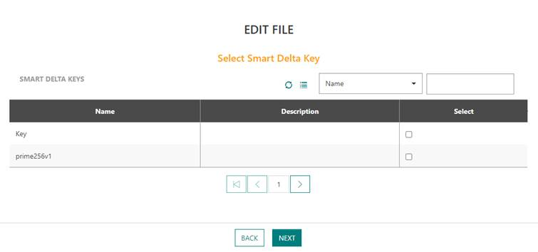
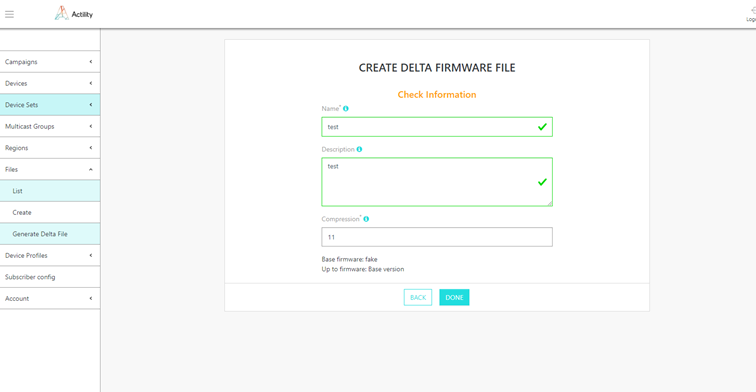
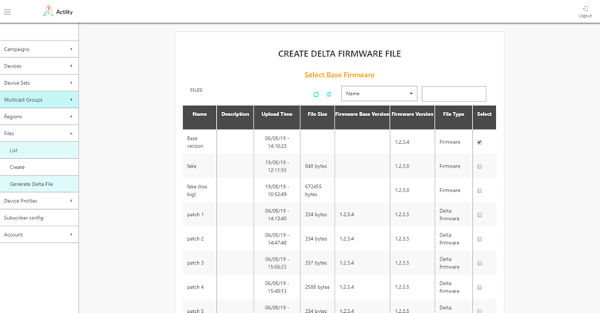
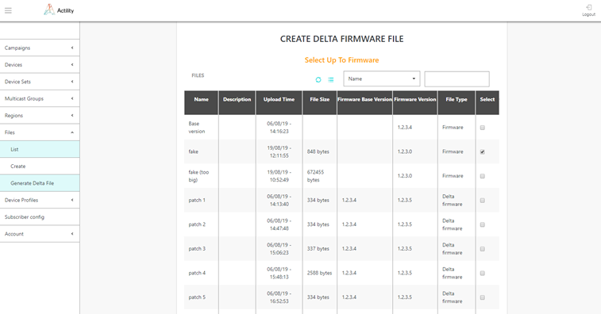
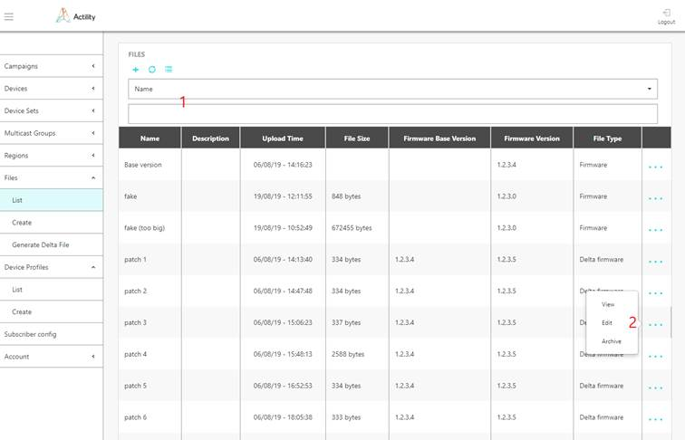
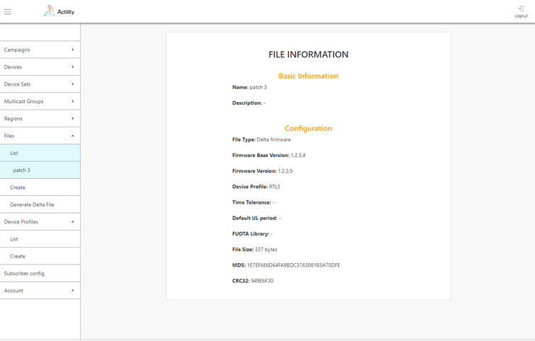

# Managing files

## Provisioning a file

You can provision three types of files: firmware, delta firmware and
binary.

1. Select *Files \> Create* to upload a new file, and select the file
   type in the first screen.

2. For a binary file:

   a.  Enter the following information in the second screen:

    - **Name**: freeform text for binary file identification
    - **Description**: freeform paragraph for binary file identification
    - **File**: open the file browser to select the file to upload on the server

​		b.  On the next screen verify information you added and select DONE if everything is fine.

3. For a firmware file, enter the following information in the second
   screen:

    -   **Name**: freeform text for firmware file identification
    -   **Description**: freeform paragraph for firmware file identification
    -   **Firmware version**: use Actility format X.Y.Z.P (X: major version, Y:
    minor version, Z: maintenance version, P: patch version) so FUOTA
    supports notification for downgrade and upgrades, or a freeform
    32-bit format but FUOTA can only notify about firmware differences.
    -   **Time Tolerance (in seconds)**: possible device clock drift which
    should be tolerated by FUOTA when starting multicast session
    -   **Default UL period (in seconds)**: UL period affects a lot of timers
    which control unicast commands stages of the campaign. FUOTA use
    provided value to automatically calculate these timers
    -   **FUOTA Library**: "Smart Delta" or "Other 3rd Party". The type of
    device library used to process reliable multicast related commands,
    fragmentation session and firmware upgrade
    -   **File**: open the file browser to select the file to upload on the
    server

4.  For a delta firmware file, enter the following information in the
    second screen:

    -   **Name**: freeform text for firmware file identification
    -   **Description**: freeform paragraph for firmware file identification
    -   **Firmware Base Version**: current version of the software running on
    the device to which this delta patch could be applied. Use Actility
    format X.Y.Z.P so FUOTA supports notification for downgrade and
    upgrades, or a freeform 32-bit format but FUOTA can only notify
    about firmware differences.
    -   **Firmware Version**: firmware version to which device will be upgraded
    by this delta patch
    -   **Time Tolerance**: possible device clock drift which should be
    tolerated by FUOTA when starting multicast session. Time tolerance
    specified in File configuration has precedence over Time tolerance
    specified in Device profile configuration.
    -   **Default UL period**: UL period affects a lot of timers which control
    unicast commands stages of the campaign. FUOTA use provided value to
    automatically calculate these timers. Default UL period specified in
    File configuration has precedence over Default UL period specified
    in Device profile configuration.
    -   **FUOTA Library**: type of device library used to process reliable
    multicast related commands, fragmentation session and firmware
    upgrade
    -   **File**: open the file browser to select the file to upload on the
    server

5.  On the next screen, select the device profile from the list of
    available device profiles. Device profile is used to
    match which firmware files could be loaded into given device and
    parameters of this firmware files. Device is matched against profile
    using (Producer ID, Module ID, HW Revision) triplet.

6.  *(Step* *only* *needed* *when* *a full Firmware* *file is being*
    *created)* On the next screen, select the Smart Delta Key associated
    with the firmware file. When Smart Delta files will be generated
    using this firmware file as "Firmware Base Version", this Smart Delta Key will be used to sign the delta file
    created by the FUOTA Server. A matching public key must be contained
    on the device (embedded in the Smart Delta library). Smart Delta key
    configuration can be omitted if given device firmware does not
    contain Smart Delta library, if the Smart Delta Key is already
    configured in the Device Profile selected for the device, or if
    Smart Delta feature should not be used.

7. On the last screen verify entered parameters and press DONE if all
   information is correct.

   :::warning IMPORTANT

   If the current firmware binary file is not available, a
   file object can be created without the actual file but only with its
   metadata. This allows FUOTA server to check the current running
   software and hardware versions are correct during the update.
   
   :::

## Provisioning a file using the API

Files creation can also be performed by API using /file endpoint.

1.  Prepare your FUOTA credentials. The user authentication is based on
    "basic auth" method.

2.  Contact Actility to get the domain name of the URL: `https://*\<domainname\>*/FOTACore-API/`

## Generating delta update file

You can create a delta patch based on two firmware files already
uploaded in ThingPark FUOTA that are:

-   The firmware that is currently running on the device
-   The Target firmware to be installed on the device.

This operation will generate a delta patch, which is usually 6-8 times
smaller in size than a full firmware file.

1.  Select *Files \> Generate Delta File*.

2.  Enter below information on the first screen:

    -   **Name**: free form text for delta patch identificatio,
    -   **Description**: any additional information relevant to help file
    administration
    -   **Compression**: level of compression from 4 to 31, higher number means
    better compression. The safest level to use is 11. This level
    affects amount of free RAM required on device to uncompress patch.
    This amount could be calculated as: RAM = 2^compression^ bytes.

3.  In the second screen, select the firmware which is currently running
    on the device to be upgraded.

4.  On the third screen, select the target firmware to which device will
    be upgraded.

5.  On the last screen check that all entered parameters are correct and
    press DONE to complete delta patch creation.
    
:::warning IMPORTANT

   To generate a smart delta patch compatible with Actility smart delta 
   library, set the correct "MCU type" in the Device Profile.
   Currently, only "ST Micro - STM32L4" is supported.
   
   :::

## Browsing files

The list of files currently provisioned in the system can be obtained
via *Files \> List*.

- The table contains information about all files in the system and
  their parameters.

- The files list could be filtered by information in any column using
  selector 1 at the top of the screen.

  

- By pressing "+" option at the top you will be brought into Files
  Create screen.

- "..." option at the end of the files information row will show up
  menu 2 which will allow to "View" complete information about file
  (8), "Edit" file information and "Archive" file. Archived file will
  be no more listed in the *Files* information table. Archived files
  can be retrieved via API. Contact Actility for more details.

