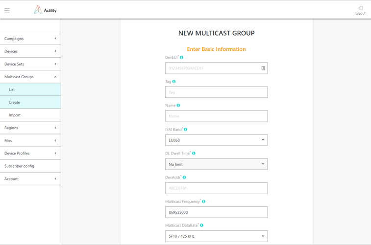
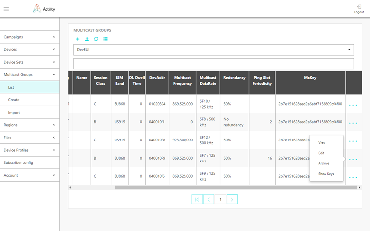
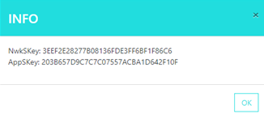
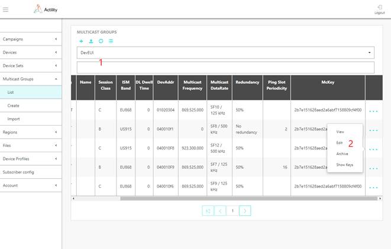
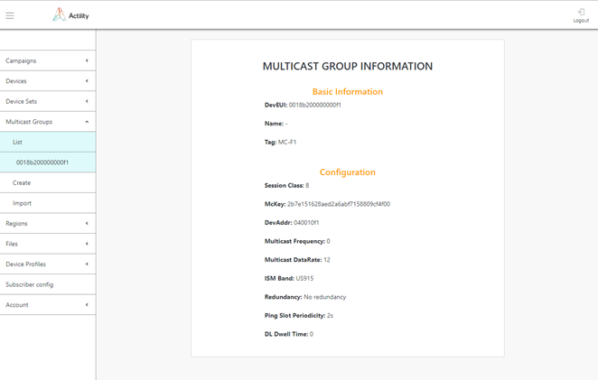

# Managing Reliable Multicast groups

It is important to understand the difference between LoRaWAN Multicast
and application level Reliable Multicast:

-   At LoRaWAN level, multicast addresses are defined. Downlink messages
    sent to this multicast addresses get broadcasted to a set of radio
    cells (list of gateways). This network level multicast does not
    provide any management or reliability mechanism

-   The Reliable Multicast protocol sits at the application layer, and
    uses both unicast commands as well as LoRaWAN multicast downlinks to
    implement reliable multicast file transfer to groups of devices.

:::warning IMPORTANT

You must first provision multicast groups in ThingPark
FUOTA where their session keys are defined. Sessions keys must be
retrieved then to provision multicast groups in ThingPark Wireless.

:::

## Provisioning Multicast groups in ThingPark FUOTA

### Provisioning a Multicast group

1.  Select *Multicast Groups \> Create* and select the Multicast group
    class B or C that is intended to be used as a new Multicast identity
    on your devices.

    -   **Class B**: This is the best profile in term of energy consumption on
    the device. Note that it can only be used if the network side
    supports it.
    -   **Class C**: This is the best profile in term of network support, as all
    type of base stations support this mode of operation including base
    station where fine GPS synchronization is not available (typically
    indoor)

2.  Enter the following information in the second screen:

    -   **DevEUI**: virtual device identifier of the LoRaWAN level multicast
    group defined in ThingPark Wireless provisioning. This virtual
    device identifier is used on the tunnel API to send downlinks to the
    group, it is converted to the multicast DevAddr on the radio
    interface (see below).
    -   **Tag**: freeform text to search for one or multiple Multicast Groups
    -   **Name**: freeform text for Multicast Group identification
    -   **ISM band**: Unlicensed band in which the devices operate, it will
    determine the maximum fragment size the FUOTA can use
    -   **DL Dwell Time**: only valid in AS923 ISM band, refer to LoRaWAN®
    Regional Parameters to understand its impact on maximum fragment
    size
    -   **DevAddr**: the multicast group address used on the LoRaWAN radio
    interface. This value must have been reserved in ThingPark Wireless
    before being assigned manually to the group so it is assigned
    uniquely in the LoRaWAN network and will not collide with addresses
    allocated during the Join process
    -   **Multicast frequency**: Ping Slot RF channel frequency in Hz for
    Multicast Class B and RX2 frequency in Hz for Multicast Class C
    -   **Multicast Datarate**: Downlink data rate used on Ping Slot for
    Multicast Class B and RX2 frequency for Multicast Class C, refer to
    LoRaWAN® Regional Parameter for complete description of this field
    in different ISM bands
    -   **Redundancy**: ratio of coded fragments over total number of
    fragments. Example: 50% means that for every uncoded fragment, a
    coded fragment is added.
    -   **McKey**: 128-bit multicast master key used during Multicast session.
    It can be left blank, in which case a random one is generated



3.  Click DONE to complete the Multicast group creation.

### Provisioning Multicast groups using mass import

Multicast groups information can be imported using *Multicast Groups \>
Import*.

1.  Click *Multicast groups \> Import*.

2.  Click *Sample file*.

3.  Create your import file based on the sample file. The file format is
    as follows:

    -   CSV (rfc4180) with no header row and comma-separated
    -   Column A: mandatory, Multicast DevEui
    -   Column B: mandatory, Multicast session class
    -   Column C: optional, Mckey
    -   Column D: mandatory, Multicast devAddr
    -   Column E: mandatory, Multicast Freq
    -   Column F: mandatory, Multicast data rate
    -   Column G: mandatory, ISM band
    -   Column H: mandatory, Redundancy
    -   Column I: mandatory, Downlink dwell time
    -   Column J: optional, Ping Slot Periodicity
    -   Column K: optional, Name
    -   Column L: optional, Tag
    -   Column M: optional, Initial fCntDown

Example:

```json
0123456789ABCDEF,C,0123456789ABCDEF0123456789ABCDEF,ABCDEF01,869525000,2,EU868,ONE_TO_TWO,0,,Test
MC group,TEST,0
```

4.  Click the paper clip button, select your import file.

5.  Click *Import*.

### Provisioning a Multicast group using the API

Creation of a Multicast Group can also be performed by API using
/mcgroups endpoint.

1.  Prepare your FUOTA credentials. The user authentication is based on
    "basic auth" method.

2.  Contact Actility to get the necessary information to use the
    following URL: `https://*\<domainname\>*/FOTACore-API/`

## Retrieving the session keys of Multicast groups

Before being provisioning in ThingPark Wireless, the Multicast session keys of multicast groups must be retrieved from ThingPark FUOTA.

### Retrieving the session keys of a Multicast group

1.  Select *Multicast Groups \> List*, and scroll on the right side of
    the Multicast groups list.

2.  Click the *"..."* sign of the row corresponding to the Multicast
    group being created, and select *Show keys*.

3.  The **NwkSKey** and **AppSKey** appear. Store both
    values (copy-paste is advised) for ThingPark Wireless provisioning.





### Exporting session keys of Multicast groups

By performing a mass export of the multicast groups you have provisioned
in ThingPark FUOTA, you can retrieve all their sessions keys that are
needed to provision the multicast groups in ThingPark Wireless.

1.  Click *Export as CSV* button in the top part.

2.  The file format is as follows:

    -   CSV (rfc4180) with no header row and comma-separated
    -   Column A: Multicast DevEui
    -   Column B: Multicast session class
    -   Column C: Mckey
    -   Column D: Multicast devAddr
    -   Column E: Multicast Freq
    -   Column F: Multicast data rate
    -   Column G: ISM band
    -   Column H: Redundancy
    -   Column I: Downlink dwell time
    -   Column J: Ping Slot Periodicity
    -   Column K: Name
    -   Column L: Tag
    -   Column M: Initial fCntDown
    -   Column N: Multicast AppSKey
    -   Column O: Multicast NwkSKey

Example:

```json
18b200FFFFFFF1, B, 2B7E151628AED2A6ABF7158809CF4F3C, ABCDEF01,
869525000, 2, EU868, FIVE_TO_SIX, 0, 128, McGroup1,MC_PARIS,0,
203B657D9C7C7C07557ACBA1D642F10F, 3EEF2E28277B08136FDE3FF6BF1F86C6
```

3.  Store the session keys. They will be needed when provisioning the
    multicast group in ThingPark Wireless.

## Provisioning a Multicast group in ThingPark Wireless

You must have retrieved the session keys of the multicast group.

1.  Follow *ThingPark Wireless Network Manager User Guide* and
    *ThingPark Wireless Device Manager User Guide* to setup Tags on the
    radio base stations before setting up the Multicast Group. It
    requires higher privileges than Subscriber to define new tags.

2.  In Device Manager (follow *ThingPark Wireless Device Manager User
    Guide*), create a new Multicast Group with the following parameters:

    -   **LoRaWAN® version**: all versions are supported
    -   **Class type**: select **Class B** or **C** as defined in FUOTA
    -   Ping slot period (class B only): **Multicast Ping slot period** defined in FUOTA
    -   **DevEUI**: **Multicast group DevEUI** defined in FUOTA
    -   **DevAddr**: **Multicast group DevAddr** defined in FUOTA
    -   **NwkSKey**: **Multicast group NwkSKey** exported from FUOTA in previous step
    -   **Connectivity plan**: select a **Multicast connectivity plan**, Unicast ones are not applicable
    -   **AppSKey**: **Multicast group AppSKey** exported from FUOTA in previous step
    -   **AS Routing profile**: points to FUOTA which is defined in Application Server section of the Device Manager, with the same parameters as the one defined for End Devices:
        -   **Type**: HTTP Application Server
        -   **Content-type**: JSON untyped
        -   **Source ports**: \*
        -   **Destinations**: Contact Actility to get the domain name.
        -   **Routing strategy**: Sequential

3.  In Device Manager (follow *ThingPark Wireless Device Manager User
    Guide*), edit the Multicast group newly created, and select the
    Multicast tag(s) used to tag all base stations to be used for
    Multicast.

:::warning IMPORTANT

Do not miss this step or Multicast downlink frames will
not be transmitted over the set of tagged base stations. This step cannot be performed during Multicast Group creation.

:::

## Browsing Multicast groups

The list of multicast groups currently provisioned in the system can be
obtained via *Multicast Groups \> List*.

- The table contains information about all multicast groups in the
  system and their parameters.

- The multicast groups list could be filtered by information in any
  column using selector 1 at the top of the screen.

  

- By pressing "+" option at the top you will be brought into Multicast
  Groups Create screen.

- The "..." option at the end of the multicast group information row
  will show up menu 2 which will allow to "View" complete information
  about multicast group, "Edit" multicast group
  information, retrieve security keys (see above) and "Archive"
  multicast group. Archived multicast group will be no more listed in
  the multicast groups information table. Archived multicast groups
  can be retrieved via API. Contact Actility for more details.


