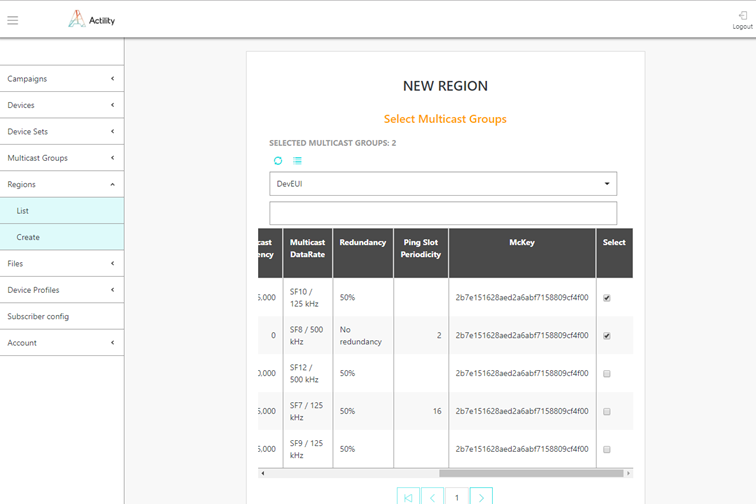
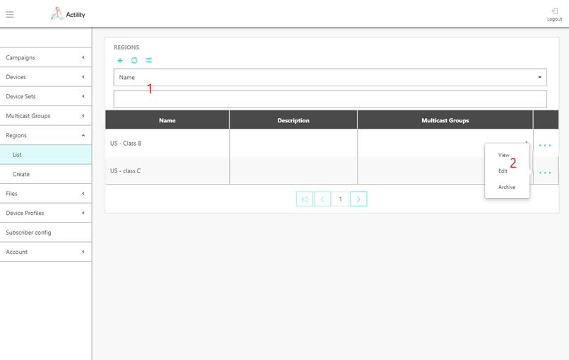
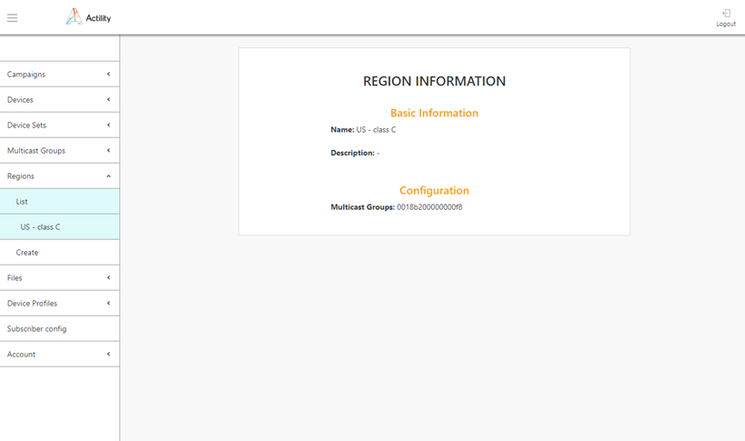

# Managing reliable Multicast regions

Reliable Multicast regions are not provisioned in ThingPark Wireless.
They are only used by ThingPark FUOTA server for application level
reliable multicast group management.

## Provisioning a region

1.  Select *Regions \> Create*, and enter the information below in the
    first screen:

    -   **Name**: freeform text for region identification
    -   **Description**: freeform paragraph for region identification

2.  Then select Multicast Groups in the second screen, by clicking the
    checkboxes on the right of the rows of Multicast Groups to be added
    in the set.

3.  Then, click DONE in the third screen.

## Provisioning a region using the API

Region creation can also be performed by API using /regions endpoint.

1.  Prepare your FUOTA credentials. The user authentication is based on
    "basic auth" method.

2.  Contact Actility to get the domain name of the URL: `https://*\<domainname\>*/FOTACore-API/`

## Browsing regions

The list of regions currently provisioned in the system can be obtained
via *Regions \> List*.

- The table contains information about all regions in the system and
  their parameters.

- The Regions list can be filtered by information in any column using
  selector 1 at the top of the screen.

  

- By pressing "+" option at the top you will be brought into Regions
  Create screen.

- The "..." option at the end of the region information row will show
  up menu 2 which will allow to "View" complete information about
  region, "Edit" region information and "Archive" region.
  Archived region will be no more listed in the Regions list. Archived
  regions can be retrieved via API. Contact Actility for more details.

