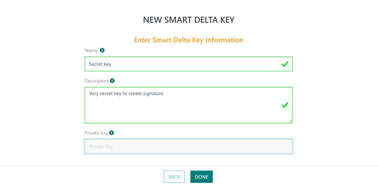
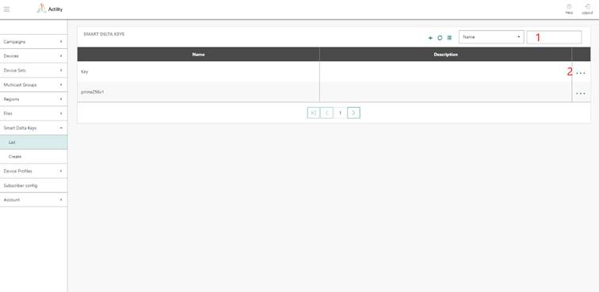

# Managing Smart Delta keys

Smart Delta keys are used to verify that a Smart Delta patch received by
a device has been created by a legitimate FUOTA Server. This
verification leverages an ECDSA signature created using a "Smart
Delta key" and appended to the patch binary by the FUOTA server. At the
end of a FUOTA campaign, devices verify the signature using the Smart
Delta public key which is embedded into Smart Delta library.

A Smart Delta key pair (private and public keys) should be obtained by
the device manufacturer for a given version of the Smart Delta library.
Different firmware versions may contain different or same versions of
Smart Delta library.

Smart Delta keys can be configured at device profile or at file levels.
If a key is specified in both places, the file key has precedence over
the device profile key. Smart Delta private key configuration can be
omitted if the target device firmware does not implement the Smart Delta
library.

Smart Delta keys are stored in the database, encrypted with a master
Smart Delta Key Encryption Key (called Smart Delta KEK). A default Smart
Delta KEK is provided with initial FUOTA Server distribution. Smart
Delta KEK can be updated via API only.

## Provisioning a Smart Delta key

1.  Select *Smart Delta Keys* *\> Create,* and enter following
    information:

    -   **Name**: freeform text for Smart Delta key identification
    -   **Description**: freeform paragraph containing details about Smart Delta
    key
    -   **Private key**: file which contains private key for given Smart Delta
    library version in PKCS\#8 format. Key pair should use ECDSA curve
    prime256v1.

### Provisioning a Smart Delta key using the API

Creation can also be performed by API using /smartdeltakeys endpoint.

1.  Prepare your FUOTA credentials. The user authentication is based on
    "basic auth" method.

2.  Contact Actility to get the domain name of the URL: `https://<domainname>/FOTACore-API/`

### Updating Smart Delta key encryption key using the API

Update can be performed by API using /smartdeltakek endpoint.

1.  Prepare the System Administrator credentials and the new Smart Delta
    KEK (AES 256 bit key). The user authentication is based on "basic
    auth" method.

2.  Contact Actility to get the domain name of the URL: `https://<domainname>/FOTACore-API/`

## Browsing Smart Delta keys

The list of Smart Delta Keys currently provisioned in the system can be
obtained via *Smart Delta Keys* *\> List*.

-   The table contains information about all Smart Delta Keys in the
    system and their parameters. The Smart Delta Keys list can be
    filtered by information in any column using selector 1 at the top of
    the screen.

-   By pressing + option at the top you will be brought into Smart Delta
    Keys Create screen.

-   "..." option at the end of the Smart Delta Keys information row will
    show up menu 2 which will allow to "View" complete information about
    Smart Delta Keys, "Edit" Smart Delta Keys information and "Archive"
    Smart Delta Keys. Archived Smart Delta Keys will be no more listed
    in the Smart Delta Keys information table. Archived Smart Delta Keys
    can be retrieved via API. Contact Actility for more details.

