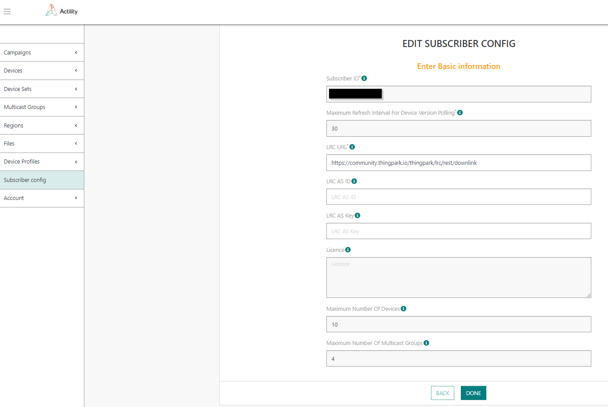

# Managing subscriber

Subscriber configuration defines various parameters defining external 
system parameters.

1.  Select *Subscriber config* and set the following
    information:
    
    -   **Subscriber ID**: unique subscriber ID assigned by platform administrator – read-only
    -   **Maximum Refresh Interval For Device Version Polling**: device configuration polling rate by platform administrator – read-only
    -   **LRC URL**: full endpoint URL on the LRC which should be used to send downlinks – read-write
    -   **LRC AS ID**: AS ID used for integration between LRC and application server; should match the AS ID configured on the LRC side if AS security is enabled (optional) – read-write
    -   **LRC AS Key**: AS Key used for integration between LRC and application server; should match the AS Key configured on the LRC side if AS security is enabled (optional) – read-write
    -   **License**: license configured by platform administrator – read-only
    -   **Maximum Number Of Devices**: maximum number of device which could be used by the subscriber; defined in configured license – read-only
    -   **Maximum Number Of Multicast Groups**: maximum number of multicast groups which could be used by the subscriber; defined in configured license – read-only

