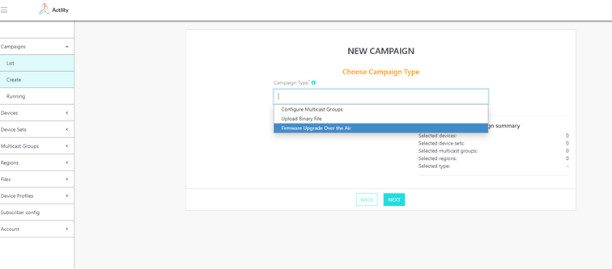
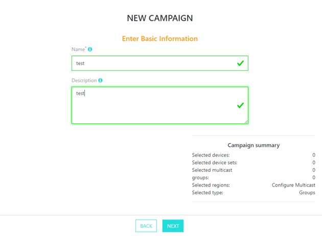
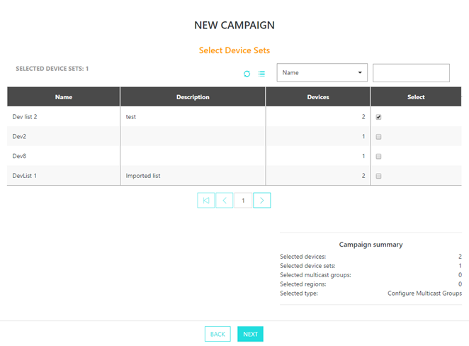
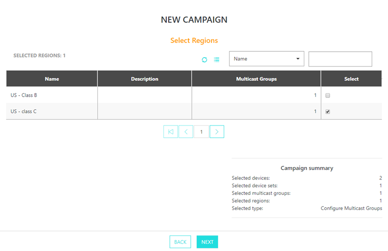
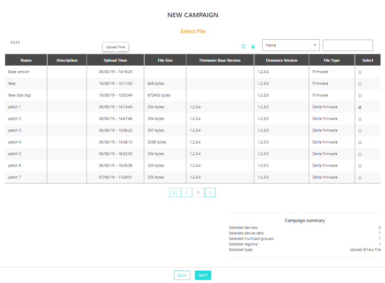
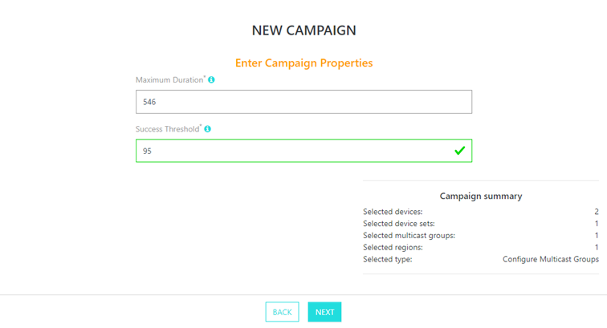
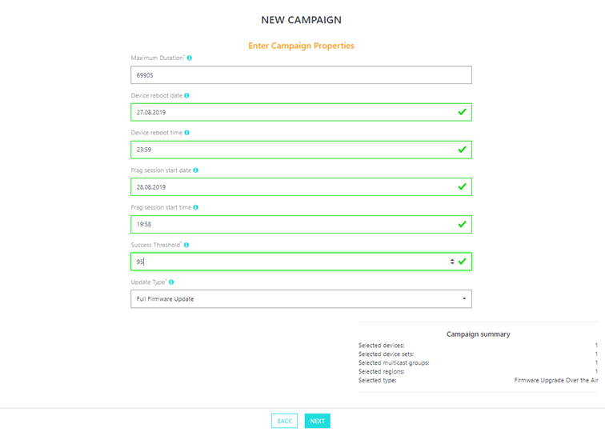

# Creating a campaign

1.  Select *Campaigns \> Create* and select a campaign type in the first
    screen.

2.  In second screen, choose the following configurations:

    -   **Name**: freeform text for campaign identification
    -   **Description**: freeform paragraph for campaign identification

3.  In third and fourth screen, select Device Sets and
    Regions that will participate to the campaign.

4. For "binary transfer" and "FW update over the air" campaigns on the
   fifth screen, you should select file which will be
   either sent to the device for "binary campaign" or firmware which is
   used to upgrade device for "FW update over the air". You can select
   either full or delta firmware upgrade if they are available for
   given device type. 

   For "configure multicast groups" campaigns, this screen is skipped.

5.  On the next screen select maximum campaign duration and campaign
    success threshold criteria ():

    -   **Maximum duration**: define a duration in minutes since switching to
    Class B or Class C after which devices will fallback to their
    original class (Class A typically) in order to preserve their
    battery if campaign fails to succeed due to bad radio environment.
    This parameter defines maximum duration of the multicast session and
    applies only to "binary transfer" and "FW update over the air"
    campaigns.

    -   **Success threshold**: percentage of devices above which the campaign is
    considered successful. The success threshold must be met at every
    stage of the campaign in order to move to next stage. The server
    will stop retransmission at the end of the campaign phase in case
    campaign is successful. Usually, we can start a new campaign with
    the reduced set of all failed devices that will consume less radio
    resources.

 

6.  For "FW update over the air" type campaigns you have to specify
    additionally the following parameters:

    -   **Device reboot date**: date when device should be rebooted and firmware
    update applied. This is useful when you want your devices to be
    upgraded in off peak hours or in planned maintenance window
    -   **Device reboot time**: time when device should be rebooted and firmware
    update applied
    -   **Fragmentation session start date**: date when fragmentation session
    should be started. This is useful when you want multicast traffic to
    be in the air only in off peak hour or you need file to be sent to
    devices at specific moment
    -   **Fragmentation session start time**: time when fragmentation session
    should be started
    -   **Update type**: full or delta firmware update should be applied.

7.  The last screen provides a summary of the campaign including the
    total number of devices selected by the list of Device sets filtered due to selected campaign properties and
    parameters. Click DONE to save the campaign.

