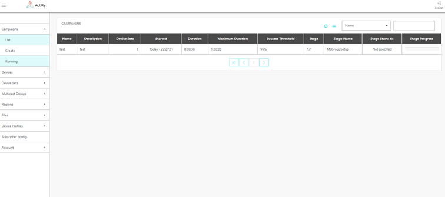

# Monitoring update campaigns

1.  Select *Campaigns \> Running* and monitor campaign progress.

2.  A campaign is organized in 6 stages when a "Device reboot time" is
    not requested:

    -   Stage 1 - McGroupSetup: FUOTA waits for UL message before sending
    1st DL command for all devices. FUOTA sends **McGroupSetupReq** to
    each device of the campaigns

    -   Stage 2 - FragSessionSetup: FUOTA sends **FragSessionSetupReq** to
    each device of the campaigns

    -   Stage 3 - McClassB\[C\]SessionSetup: FUOTA sends
    **McClassB\[C\]SessionSetupReq** to each device of the campaigns

    -   Stage 4 - DlFragment: FUOTA sends **DlFragment** over multicast,
    starting with uncoded fragments. If FEC is active (redundancy ≠
    NO_REDUNDANCY_ONE), coded fragments are also sent

    -   Stage 5 - FragSessionStatus: Once all fragments have been sent,
    FUOTA sends **FragSessionStatusReq** over multicast

    -   Stage 6 - Multiple rounds of transmissions: in case FEC is
    inactive, uncoded fragments are sent again if not all devices
    succeeded to receive all fragments

3.  A campaign is organized in 7 stages when a "Device reboot time" is
    requested:

    -   Stage 1 - McGroupSetup: FUOTA waits for UL message before sending
    1st DL command for all devices. FUOTA sends **McGroupSetupReq** to
    each device of the campaigns

    -   Stage 2 - DevRebootTimeSetup: FUOTA sends **DevRebootTimeReq** to
    each device of the campaigns

    -   Stage 3 - FragSessionSetup: FUOTA sends **FragSessionSetupReq** to
    each device of the campaigns

    -   Stage 4 - McClassB\[C\]SessionSetup: FUOTA sends
    **McClassB\[C\]SessionSetupReq** to each device of the campaigns

    -   Stage 5 - DlFragment: FUOTA sends **DlFragment** over multicast,
    starting with uncoded fragments. If FEC is active (redundancy ≠
    NO_REDUNDANCY_ONE), coded fragments are also sent

    -   Stage 6 - FragSessionStatus: Once all fragments have been sent,
    FUOTA sends **FragSessionStatusReq** over multicast

    -   Stage 7 - Multiple rounds of transmissions: in case FEC is
    inactive, uncoded fragments are sent again if not all devices
    succeeded to receive all fragments.

For exact message details during each stage, refer to the [ThingPark FUOTA Product Description Guide](/Functionalities/).