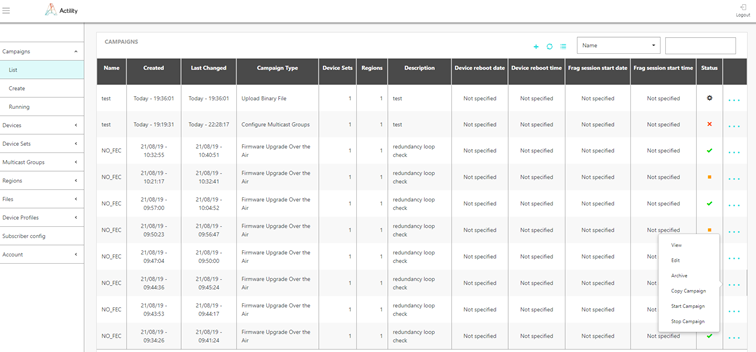
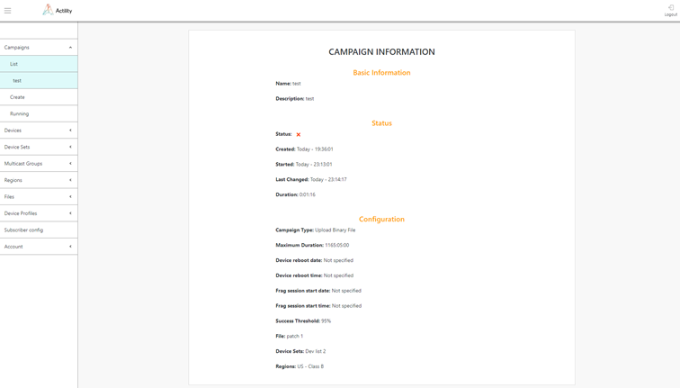

# Running update campaigns

1.  Select *Campaigns \> List* and click the *"..."* sign of the row
    corresponding to the campaign to start, and select *Start campaign*. You can stop campaign by selecting "..." *Stop campaign*. Current campaign status is indicated in status column.

2.  When a campaign is stopped, several steps are performed internally
    depending on the on-going stage (see section 4.3 for details about
    campaign stages):

    -   campaign was stopped during stages 1 - 3 (or stage 4 if device
    reboot time was requested): stage is terminated immediately, if
    device reboot time was specified, it is cancelled; new stages are
    not executed.

    -   campaign was stopped on Stage 4 (Stage 5 if device reboot time was
    requested): stage is terminated immediately, new stages are not
    performed, no more data fragment is sent. If device reboot time was
    specified for the campaign, it is cancelled. A command is sent to
    the devices to remove downloaded firmware image (for "firmware
    update" campaigns), new stages are not executed.

    -   campaign was stopped on Stage 5 - 6 (Stage 6 -- 7 if device reboot
    time was requested): stage is terminated immediately, new stages are
    not performed

3.  The following table shows the campaign status:

-------------------------------------------------------------------------------------- -----------------------------------------

|                                                              | Campaign Status                         |
| ------------------------------------------------------------ | --------------------------------------- |
|  | Configured but not yet started campaign |
|  | Running campaign                        |
|  | Stopped campaign                        |
|  | Failed campaign                         |
|  | Successfully finished campaign          |

4. To get complete information about the campaign, click *View*.

   

5. To archive the campaign, click *Archive*. Archived campaign will be
   no more listed in the campaign information table. Archived campaigns
   can be retrieved via API. Contact Actility for more details.

6.  If campaign have not been started yet you can edit its parameters by
    selecting *Edit* menu option.

7.  You can create new campaign using the complete set of data of
    already existing campaign by selecting *Copy campaign* option.