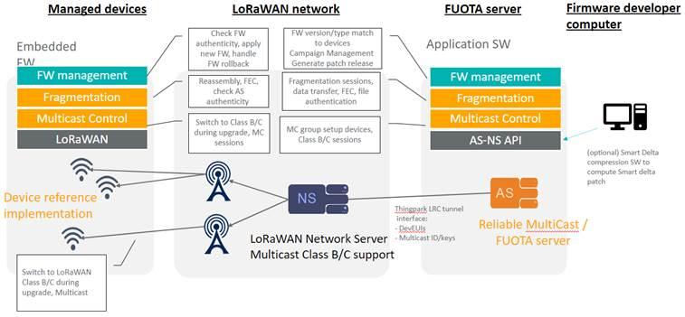

# ThingPark FUOTA solution architecture description

The ThingPark FUOTA solution is composed of the following components:

-   End Device - An embedded FUOTA application library running on top
    of LoRaWAN stack and controlled by Embedded Application
-   ThingPark Wireless - LoRaWAN OSS and core network
-   ThingPark FUOTA - Standalone server controlling reliable multicast
    file transfer and over the air firmware update of end devices
-   Smart Delta compression software to compute Smart delta patch. This
    tool is required only if customers want to create Smart delta patch
    offline.​

