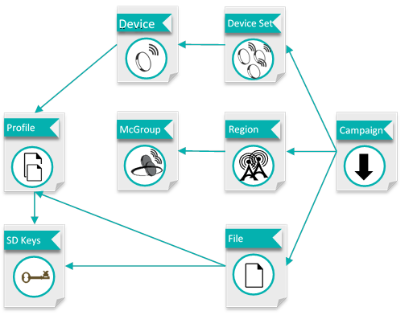

# ThingPark FUOTA solution overview

The ThingPark FUOTA platform allows you to manage large groups of
LoRAWAN devices over the air during their lifecycle:

-   The Reliable Multicast function manages reliable transmission of
    files (e.g. configuration files) to the group.
-   The FUOTA function manages firmware upgrades, and also provides an
    optional differential firmware upgrade ("Smart Delta") function.

FUOTA service includes:

-   Coordination of Device and Multicast Group data with ThingPark
    Wireless and ThingPark Enterprise
-   Management of Multicast groups and configuration of
    reliable multicast client devices to add or remove them from the
    groups
-   Orchestration and monitoring of FUOTA campaigns
-   Management of Multicast sessions using LoRaWAN class B or
    class C
    -   Multicast Optimization of battery and radio consumption during
        RMC campaigns
    -   Scheduling & throttling of sessions to minimize impact on
        network and business operations
-   Management file fragmentation sessions and adding of redundancy
    information

Following features are also included:

- Device reference firmware repository
- Auditing of device firmware versions
- Orchestration and monitoring of FUOTA campaigns
- Generation of Smart Delta firmware patches
- Encryption and electronic signature of firmware updates and patches

ThingPark FUOTA is a standalone application server that interacts with
ThingPark LoRaWAN® network server to control end devices, set of end
devices, multicast groups, regions and campaigns.

Subscribers interact with ThingPark FUOTA server through a Web User
Interface that allows easy creation and management of campaigns. All
operations are also available via API, refer to FUOTA API description for more details.

The figure below illustrates the various objects managed by ThingPark
FUOTA server and their relationships.

