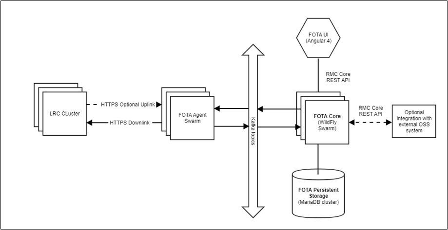

# Server architecture overview

FUOTA Server consists of 3 major components:

-  [Core](/Server-architecture/RMC-core/)
-  [Agent](/Server-architecture/RMC-agent/)
-  [Relational Database (MariaDB)](/Server-architecture/FUOTA-database/)

The User Interface is implemented as a WEB browser application based on
Angular 4 framework and uses Core module REST API to interact with Core.